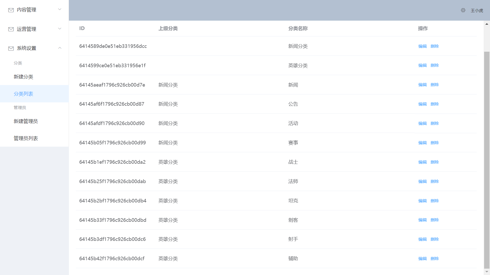

### 环境配置
* <a href="https://github.com/nodejs/node/releases"></img></a>
* <a href="https://www.mongodb.com/try/download/community"></img></a>
* </img>
>Node.js v16以上版本可能会导致部分包无法使用，mongoDB v6会在部分window10上无法使用。

### 后台管理系统和服务端的配置与启动
1. 先将admin/src/router/index.js中的beforeEach()与admin/src/http.js中的拦截器注释掉。
2. 然后将server/middleware/auth.js中的登录中间件注释掉。
3. 进入/admin与/server中，**npm run serve**启动后台管理系统与服务端。
4. 进入http://localhost:8080/#/admin_users/create，新建管理员。
>执行完上述步骤后即可把上述注释解除。

### web端的配置与启动
1. 因用到mongo中的聚合查询，需先进入后台管理系统中的http://localhost:8080/#/categories/create，中如图建立分类。
2. 进入/web中,**npm run serve**启动web端。
3. 执行http://localhost:3000/web/api/heroes/init，导入英雄数据。
4. 执行http://localhost:3000/web/api/news/init，导入新闻数据。
>若出现此网站无法提供安全连接的问题可能是使用了https协议，换回http协议即可。
