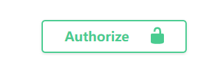

### 环境配置
* <a href="https://github.com/nodejs/node/releases"></img></a>
* <a href="https://www.mongodb.com/try/download/community"></img></a>
* </img>
>Node.js v16以上版本可能会导致部分包无法使用，mongoDB v6会在部分window10上无法使用。

### 项目启动
1. 进入/admin，**npm run serve**启动后台管理系统
2. 进入/server，**npm i、npm i fork-ts-checker-webpack-plugin、npm i webpack**,***npm run start admin**启动后台服务API；**npm run start web**启动前端服务API
3. 进入/web,**npm run dev**启动web端页面

### 用户注册与登录
1. 进入http://localhost:3008/api-docs前端服务API，在用户注册接口中注册用户，并在登录接口中登录后会返回token字符串，在swagger页面中完成验证，即可使用用户中的各个接口。